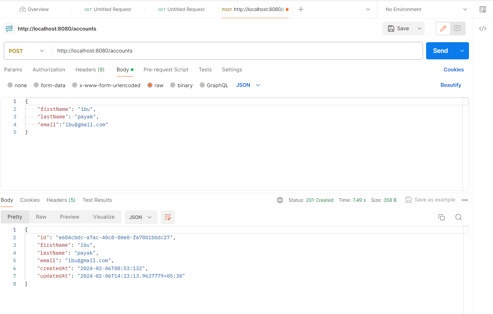

## Introduction

Implement create a new customer using Stripe Create Customer API.

## Setup
### Pre-requisities

To run the application you would require:

- [Java](https://www.azul.com/downloads/#zulu)
- [Temporal](https://docs.temporal.io/cli#install)
- [Docker](https://docs.docker.com/get-docker/)
- [Stripe API Keys](https://stripe.com/docs/keys)

Sign up for a Stripe account and get your API keys from the [Stripe Dashboard](https://dashboard.stripe.com/apikeys).
Then in `application.properties` file add the following line with your secret key.

```properties
stripe.api-key=key
```

## How to run tests
To run integration test use below command

```sh
./gradlew test
```
## Implementation
All the Temporal configuration has been done in main method of MidasApplication

In temporal we have workflow and activity to manage the long-running business processes

The CreateAccountWorkflowImpl class defines a workflow that calls the createAccount method using Temporal's activity stub and
CreateAccountActivityImpl interact with Strip API and create Account

## Assumption

I only thought to create user of Strip type only, hence this workflow is implemented for create user with Strip only.

Since I could not replicate database in local due to some authentication issue (same query I had asked you in mail but didn't get reply), hence I couldn't able to check properly, though I have tested Post method using Postman and it's working as expected (attached ss below)




## Run

You are required to first start the temporal server using the following command

```sh
temporal server start-dev
```
This command starts a local Temporal Cluster, we can see workflow at http://localhost:8233.

and then run the application using the following command or using your IDE.

```sh
./gradlew bootRun
```
